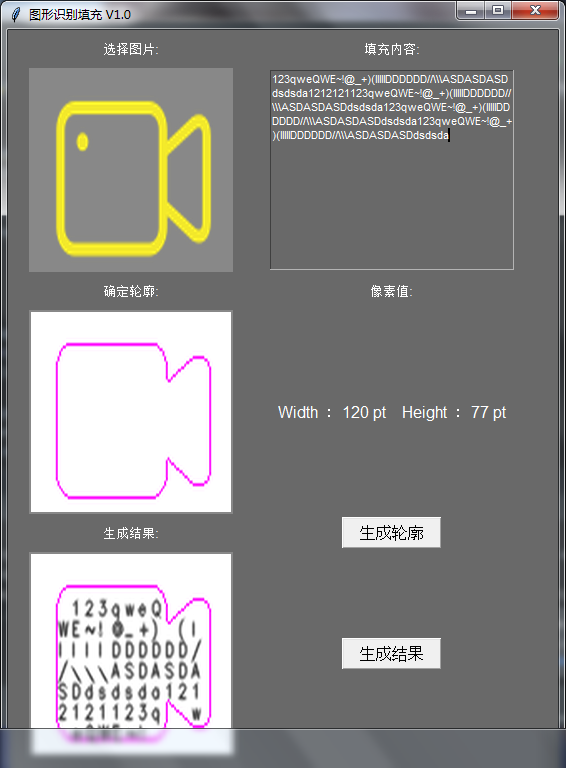
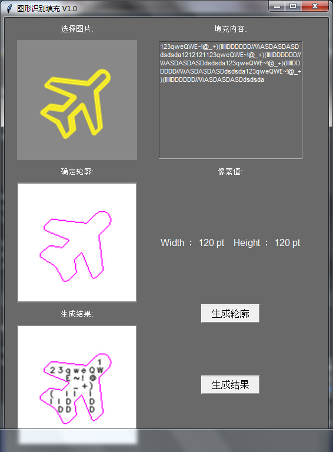
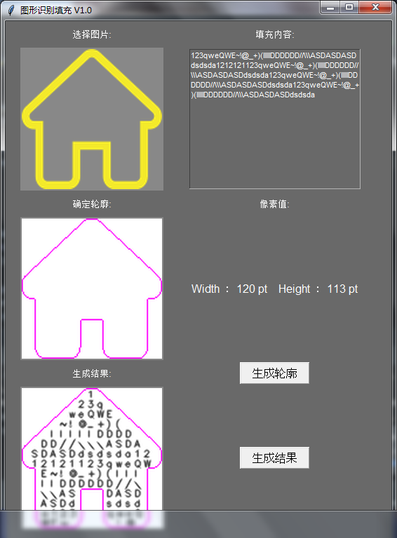
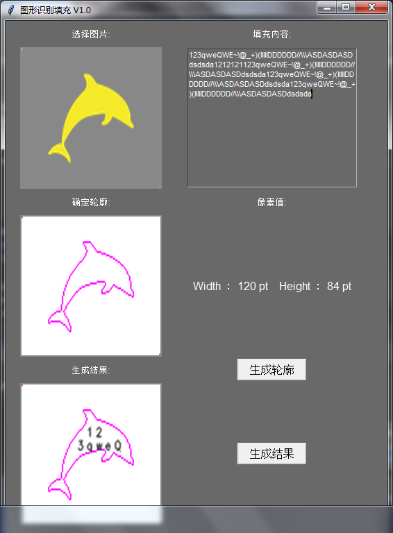

# 使用说明
启动程序文件->Fish/GUI/test.py

        Step1： 打开图片

点击第一幅图片即可选择测试图片,不可有中文路径

        Step2： 生成轮廓

点击生成轮廓按钮,即可生成图1的轮廓信息(单目标,最外围轮廓)

        Step3： 填充文字

在右上角的文本框内输入字符(英文及符号),点击填充文字按钮即可在轮廓内填充文字

# 效果图

上一版本, 新的未截图(白底/彩色)

        by Later 